# 🛡️ Ranas Security Stack
### Automated. Invisible. Secure by Design.

I don't just "fix servers". I architect **Zero-Trust Infrastructure** for FinTech and High-Load projects using Kubernetes and GitOps.
My goal is to build systems that secure themselves without slowing down developers.

---

## 🛠️ Security Architecture

This is the standard **Ranas Security Stack** topology I implement:

```mermaid
graph TD
    User([👤 Client / Traffic]) -->|HTTPS/443| CF[☁️ Cloudflare Edge]
    
    subgraph "Zero Trust Perimeter"
        CF -->|Tunnel| WG[🔐 WireGuard Gateway]
        WG -->|GitOps| K3s[☸️ K3s Cluster]
    end
    
    subgraph "Automated Defense"
        K3s -->|Scans| IAM[🐍 Cloud-IAM-Optimizer]
        K3s -->|Monitor| Grafana[📊 Grafana / Kuma]
    end
    
    style CF fill:#f96,stroke:#333,stroke-width:2px
    style K3s fill:#326ce5,stroke:#333,stroke-width:2px,color:#fff
    style IAM fill:#ffd343,stroke:#333,stroke-width:2px
```

-----

## 🚀 Core Products (Open Source)

| Product | Status | Description |
| :--- | :--- | :--- |
| **[Cloud-IAM-Optimizer](https://github.com/ranas-mukminov/Cloud-IAM-Optimizer)** | 🟢 **Stable** | **Identity Security.** Automated audit tool for AWS IAM. Finds dormant admins & MFA gaps. |
| **[Kube-Simple-Audit](https://github.com/ranas-mukminov/Kube-Simple-Audit)** | 🟢 **New** | **K8s Security.** Lightweight Bash script to find privileged pods & root containers in 5 seconds. |
| **[Secure-K3s-Template](https://github.com/ranas-mukminov/Secure-K3s-GitOps-Template)** | 🟡 **Beta** | **Infrastructure.** Production-ready K3s cluster template with GitOps & Cloudflare Tunnel. |
-----

## 💻 Tech Stack & Tools

  * **Defense:** WireGuard, Cloudflare Tunnels, Trivy, Falco
  * **Orchestration:** Kubernetes (K3s), Helm, Docker
  * **Code:** Python (Boto3, Pydantic), Terraform, Ansible
  * **CI/CD:** GitHub Actions (True GitOps workflows)

-----

### 📬 Need an Audit?

If you want to secure your infrastructure "by design" and move from manual ops to automated defense:

👉 **[Book a 15-min Architecture Review](https://run-as-daemon.dev/en/services/express-audit-hardening.html)**
